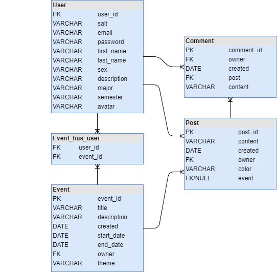

# Cafe Nexus - Gruppe ROFL

## Kravspec

### Server

* S1: Server skal kunne validere loginforsøg som inkluderer et hashed password.
* S2: Serveren skal udstille et interface, som gør det muligt at oprette/slette/redigere en bruger.
* S3: Serveren skal udstille et interface, som gør det muligt at oprette en kommentar, et opslag eller en begivenhed.
* S4: Serveren skal udstille et interface, som lister alle brugere, opslag eller begivenheder i systemet.
* S5: Serveren skal udstille et interface, som lister specifikke brugere, opslag eller begivenheder i systemet.
* S6: Serveren skal udstille et API, som gør det nemt at udarbejde klienter der kan trække på serverens funktionalitet. API’et skal dække følgende funktioner:

  * En bruger skal kunne logge ind/ud.
  * En bruger skal kunne slette sin konto.
  * En gæst skal kunne oprette sig som bruger.
  * En bruger skal kunne opdatere egne brugeroplysninger.
  * En bruger skal kunne oprette en kommentar.
  * En bruger skal kunne oprette et opslag.
  * En bruger skal kunne oprette en begivenhed.
  * En bruger skal kunne finde informationer om den valgte bruger eller begivenhed.

### Klient

* K1: En gæst skal kunne oprette sig som bruger.
* K2: En bruger skal kunne logge ind/ud.
* K3: En bruger skal kunne slette sin konto.
* K4: En bruger skal kunne opdatere egne brugeroplysninger.
* K5: En bruger skal kunne oprette en kommentar.
* K6: En bruger skal kunne oprette et opslag.
* K7: En bruger skal kunne oprette en begivenhed.
* K8: En bruger skal kunne finde informationer om den valgte bruger eller begivenhed

## ER-Diagram

## Klassediagram
[Link til klassediagram](https://www.lucidchart.com/documents/view/9230b5ab-aea0-4a3e-a65d-e626e94e7a80)
